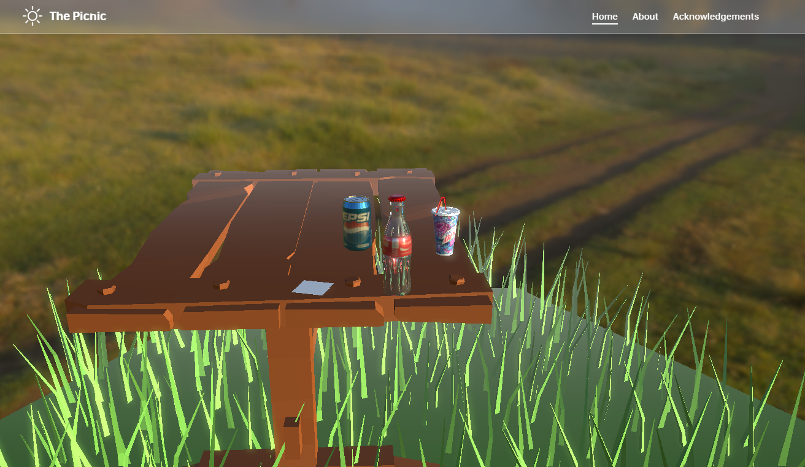
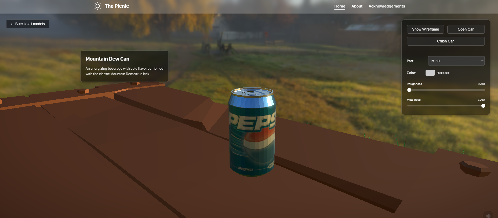
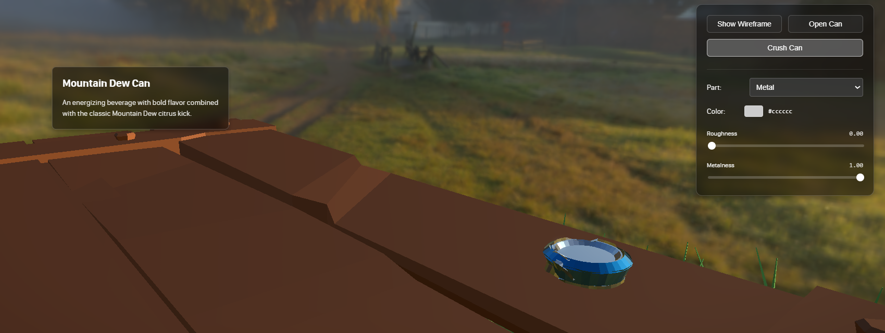
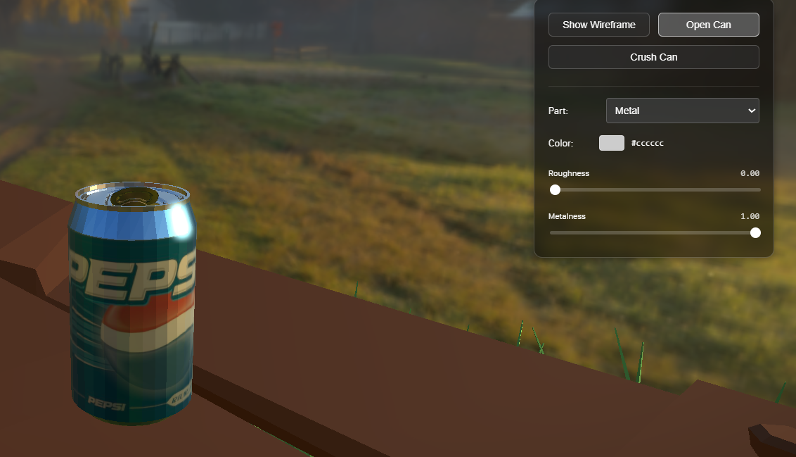
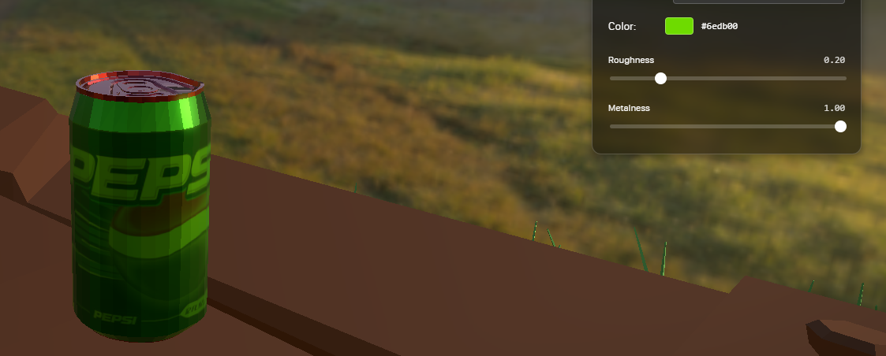

<h1 align="center" id="title">Web 3D Design Showcase Website</h1>

<p id="description">Showcase website for my Web 3D design module</p>

<h2>Project Screenshots:</h2>













<h2>🛠️ Installation Steps:</h2>

<p>1. Open CMD at project root and type</p>

```
npm install
```

<p>2. Run development build</p>

```
npm run dev
```

<p>3. Connect at localhost:5000</p>